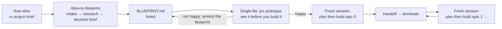

# idea-to-blueprint

**Two paragraphs of raw idea in. One evidence-backed build blueprint out. Then your coding agent ships it epic by epic, without guessing.**

`idea-to-blueprint` is an agent skill for **Claude Code**, **Codex** and **claude.ai**. You describe a product in plain words (or drop in a project brief). The skill interviews you, researches the market and the stack on the live web, makes the architecture decisions, and writes a single `.md` file detailed enough that a fresh agent session can build any epic from it with nothing else to go on.

It is built for people who want to do **agentic engineering**, not vibe coding.

```
/idea-to-blueprint  I want a Telegram bot that helps freelancers track invoices and nudges late clients.
```

---

## What you walk away with

| You give | You get |
|---|---|
| A raw idea, 2 lines to 2 paragraphs, or an existing brief | `docs/BLUEPRINT.md`: one self-sufficient document, often 100 pages, 22 sections |
| Answers to one batch of intake questions (every one has a default) | A stack with **pinned, web-verified versions**, each choice naming the runner-up and what it would have bought you |
| A "go" on a one-screen decision brief | Epics → stories → Given/When/Then acceptance criteria → tests → Definition of Done, in build order |
| | Every user-facing string written in advance, in copy tables, by ID |
| | An edge-case register across 21 categories (auth, payments, concurrency, offline, RTL, security, a11y…) |
| | `CLAUDE.md`, `AGENTS.md`, `PROGRESS.md`, `DECISIONS.md` and a ready-to-paste session prompt per epic |

**The result in practice:** in my own testing, working from a blueprint this skill produced, I complete about **3 epics in a single day** with Claude Code or Codex, each in its own clean session, each ending with a green quality gate and a written handoff. Your mileage depends on epic size and the model you run, but the ceiling moves a lot once the agent stops guessing.

---

## Vibe coding vs. agentic engineering

| | Vibe coding | With a blueprint |
|---|---|---|
| Source of truth | The chat history | The repo: `BLUEPRINT.md`, `PROGRESS.md`, `DECISIONS.md` |
| Unknown facts | The model fills the gap with something plausible | Tagged `[VERIFIED]`, `[ASSUMED]` or `[UNKNOWN → OQ-nn]`. Never guessed |
| Stack choice | Whatever the model reaches for first | Derived from ranked architecture drivers, verified on the web, versions pinned |
| "Done" means | "It seems to work" | Every acceptance criterion has an evidence line, `check` is green, the review checklist was walked |
| Long sessions | Context drifts, constraints get forgotten | One epic per fresh session. The repo is the memory |
| UI text | Improvised per screen | Copied by ID from the copy tables |
| When the spec is wrong | Silently worked around | Logged as an amendment, never a silent change |

---

## How it works



The flow is deliberately **waterfall**. All the thinking, research and decisions happen once, up front, in the strongest model you have. After that each build session only has to execute one well-specified epic, which is the single most effective way I have found to push agent hallucination toward zero.

---

## Quickstart

### 1. Install the skill

**Claude Code** (personal skill, available in every project):

```bash
git clone https://github.com/iniesohidham/idea-to-blueprint ~/.claude/skills/idea-to-blueprint
```

**Codex** (CLI or IDE extension):

```bash
git clone https://github.com/iniesohidham/idea-to-blueprint ~/.agents/skills/idea-to-blueprint
```

**claude.ai** (web or desktop): download the zip from [Releases](https://github.com/iniesohidham/idea-to-blueprint/releases), then upload it under *Settings → Capabilities → Skills*.

To scope it to one project instead, clone into `.claude/skills/` (Claude Code) or `.agents/skills/` (Codex) inside that repo.

### 2. Generate the blueprint

**Turn web search on.** This is not optional: the skill verifies versions, competitors and service availability live, and refuses to pass memory off as fact. Use the strongest model and the highest effort setting you have.

| Tool | How to invoke |
|---|---|
| Claude Code | `/idea-to-blueprint <your idea>` |
| Codex | `$idea-to-blueprint <your idea>` |
| claude.ai | Just describe the idea and ask for a blueprint. The skill triggers on its own |

What happens next:

1. **Intake.** A quick warm-up search, then one batch of questions, each with a default. Reply `defaults` to skip them all.
2. **Deep research.** 20–60 searches: domain, 5–10 competitors, architecture drivers, stack, quality tooling, integrations and locale realities, UX benchmarks. Every source is logged.
3. **Decision brief.** One screen with the interpretation, personas, architecture shape, locked stack, quality gate and epic list. Reply `go`, or correct any line.
4. **Writing.** The blueprint is written section by section so quality holds to the last page.
5. **Lint.** `scripts/lint_blueprint.py` checks the structural guarantees the build sessions depend on. Errors are fixed before delivery.

In Claude Code or Codex the skill saves `docs/BLUEPRINT.md` and creates `docs/PROGRESS.md`, `docs/DECISIONS.md`, `AGENTS.md` and `CLAUDE.md` alongside it. On claude.ai you get `<product>-blueprint.md`; put it in an empty project folder as `docs/BLUEPRINT.md`.

### 3. Prototype it in one file (before any epic)

Open your agent in the project folder and have a frontier model turn the blueprint into a **single clickable `.jsx` file**. You see the whole product, every screen, every flow, the real copy, before a line of production code exists. Changing your mind here costs minutes. Changing it in epic 6 costs days.

Copy-paste prompt:

```text
Read docs/BLUEPRINT.md fully. Build ONE self-contained file, prototype/Prototype.jsx:
a clickable React prototype of the whole product.

- Cover every screen (SCR-nn) and make every user flow (F-nn) walkable end to end.
- Use the design tokens from the Design section and the exact strings from the
  copy tables (CP-* IDs). Do not invent text.
- Show the empty, loading, error and success states for each screen.
- Let me switch between personas (P1, P2…) where their experience differs.
- Mock data inline. No backend, no network calls, no extra files.
- This is a throwaway. Do not scaffold the real project or start any epic.

When done, list anything in the blueprint that was ambiguous or contradictory
while you built it.
```

That last line matters: the prototype doubles as a second review of the blueprint. If something is off, **fix the blueprint, not the prototype**, then regenerate.

### 4. Build, one epic per fresh session

Happy with the prototype? Open a **fresh** session in the project folder and say:

```text
plan then build epic 0
```

The agent reads `CLAUDE.md` / `AGENTS.md`, `PROGRESS.md` and the relevant blueprint sections, then follows the embedded protocol:

**Orient** (preconditions, clean tree, green `check`) → **Plan** (stories, tests, tasks) → **Build** (tests first, one commit per story) → **Verify** (full gate, regression, self-review against the checklist, Definition of Done with evidence) → **Handoff** (update `PROGRESS.md` and `DECISIONS.md`, print a summary, tell you it is safe to terminate).

Close the session. Open a new one. `plan then build epic 1`. Repeat until shipped.

For maximum rigor, paste the full per-epic session prompt from **Appendix A** of your blueprint instead of the short form.

---

## Why the agent stops hallucinating

A build session that starts from a blank context has exactly two sources of truth: the repo and the blueprint. Whatever is missing or vague in the blueprint becomes a guess in code. The whole skill is organized around closing those gaps:

1. **Evidence or silence.** Every claim about the outside world carries a tag: `[VERIFIED — source, date]`, `[ASSUMED — why]`, or `[UNKNOWN → OQ-nn]`. `[UNKNOWN]` is always acceptable. A confident wrong answer never is.
2. **Decide, don't hedge.** "Use X or Y" pushes the decision onto an agent with less context. The blueprint makes the call and records the losers and the price.
3. **Write for zero context.** Every persona, flow, screen, copy line, entity, story and criterion has a unique ID, so a fresh session resolves anything by search.
4. **Shape before tools.** Architecture drivers → architecture style → technology. If no driver could have changed the stack, the drivers were decoration.
5. **Quality is specified, not assumed.** One deterministic `check` command, a review checklist, test-quality rules, fitness functions, and explicit anti-metrics (no lines of code, no coverage as a target).
6. **Fresh session per epic.** Long sessions drift. Clean sessions force every needed fact to live in the repo, where it is versioned and greppable.
7. **No silent changes.** A wrong acceptance criterion becomes a logged amendment. A decision the blueprint did not make becomes a `DR-nn` record.

---

## What is inside a blueprint

| # | Section | # | Section |
|---|---|---|---|
| 0 | Cover and how to use | 12 | Architecture (drivers, style, boundaries, fitness functions) |
| 1 | Executive summary | 13 | Tech stack and engineering conventions |
| 2 | Idea interpretation and scope | 14 | Quality strategy, review checklist, metrics |
| 3 | Research findings and benchmark | 15 | Edge-case register |
| 4 | Assumptions and decision records | 16 | Delivery plan and epic order |
| 5 | Personas | 17 | **Epics and stories** (20–60 pages) |
| 6 | Goals, non-goals, success metrics | 18 | Session protocol for Claude Code / Codex |
| 7 | User flows | 19 | Risks and mitigations |
| 8 | Screen inventory | 20 | Open questions |
| 9 | Design direction and tokens | 21 | Glossary |
| 10 | UX writing guide | 22 | Sources |
| 11 | Copy tables | A, B | Session prompts, Epic 0 files |

**Languages.** The skill talks to you in your language. Human-facing prose follows you; machine-facing text (stories, acceptance criteria, tests, architecture, IDs) is always English so the coding agent reads it unambiguously. When the users are Iranian it loads a Persian/RTL pack: Persian copy rules, Jalali dates, local payment and SMS realities, and sanctions-aware service checks. Other markets get an equivalent pack built from research.

---

## Repo layout

```
SKILL.md                              the skill: workflow, phases, guardrails
references/
  intake-questions.md                 question bank, market detection
  research-protocol.md                the seven research tracks
  architecture-decisions.md           drivers → style → boundaries → fitness functions
  code-quality-and-review.md          the gate, review checklist, metrics, anti-metrics
  design-minimal.md                   flows, screens, tokens, RTL, accessibility
  ux-writing-guide.md                 outcome-driven copy, Persian pack
  edge-case-catalog.md                21 categories of edge cases
  stories-ac-tests.md                 story, acceptance criteria and test format
  session-protocol.md                 one epic per fresh session
  blueprint-template.md               section skeleton, ID schemes, table formats
assets/                               CLAUDE.md, AGENTS.md, PROGRESS.md, DECISIONS.md templates, session prompt
scripts/lint_blueprint.py             structural linter for the generated blueprint
```

Lint any blueprint yourself (Python 3, no dependencies):

```bash
python3 scripts/lint_blueprint.py docs/BLUEPRINT.md --strict
```

---

## FAQ

**Waterfall? In this decade?**
For humans, big upfront design is expensive because writing it is slow. For agents that cost is near zero, while the cost of ambiguity is higher than ever: an agent never pushes back on a vague spec, it just guesses. So do the thinking once, with full context, and let each session execute. The blueprint still changes when reality disagrees, through a logged amendments process rather than drift.

**Why one giant file instead of a docs folder?**
One file is one thing to reference, search and version. Unique IDs make a 100-page file as navigable as a wiki, and a fresh session only reads the sections its epic points to.

**Does it work without web search?**
It will tell you it cannot meet its own bar. You either enable web access, or accept a blueprint with every external fact marked `[UNVERIFIED]` and a warning on the cover.

**Which model should I use?**
The strongest one you have, at the highest effort setting, for both the blueprint and the build sessions. The blueprint is where model quality pays off most.

**I only have a feature, not a whole product.**
Works the same. Intake shrinks to 3–6 questions and you get fewer epics.

**Can I use it on an existing codebase?**
It is designed for greenfield builds starting from Epic 0. For an existing repo, treat the output as a spec and adapt the session protocol yourself.

---

## Contributing

Issues and PRs are welcome, especially: localisation packs for other markets, new edge-case categories, linter rules, and real-world reports of where a build session still had to guess. That last one is the most valuable bug report this project can get.

If this saved you a week, a star helps other people find it.

## License

[MIT](LICENSE)
